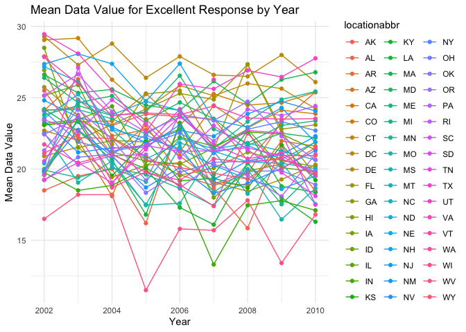
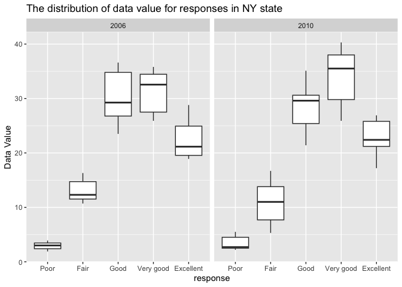
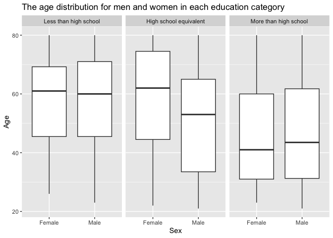
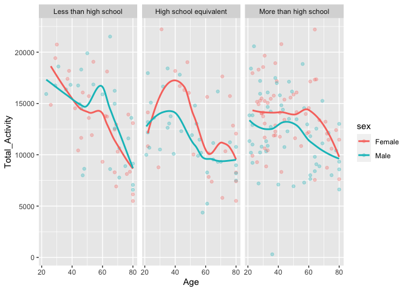

p8105_hw3_jh4617
================
Junjie Hu
2023-10-12

``` r
library(p8105.datasets)
library(tidyverse)
```

    ## ── Attaching core tidyverse packages ──────────────────────── tidyverse 2.0.0 ──
    ## ✔ dplyr     1.1.3     ✔ readr     2.1.4
    ## ✔ forcats   1.0.0     ✔ stringr   1.5.0
    ## ✔ ggplot2   3.4.3     ✔ tibble    3.2.1
    ## ✔ lubridate 1.9.2     ✔ tidyr     1.3.0
    ## ✔ purrr     1.0.2     
    ## ── Conflicts ────────────────────────────────────────── tidyverse_conflicts() ──
    ## ✖ dplyr::filter() masks stats::filter()
    ## ✖ dplyr::lag()    masks stats::lag()
    ## ℹ Use the conflicted package (<http://conflicted.r-lib.org/>) to force all conflicts to become errors

``` r
data("instacart")

theme_set(theme_minimal() + theme(legend.position = "bottom"))
```

# Problem 1

    ## # A tibble: 1,384,617 × 15
    ##    order_id product_id add_to_cart_order reordered user_id eval_set order_number
    ##       <int>      <int>             <int>     <int>   <int> <chr>           <int>
    ##  1        1      49302                 1         1  112108 train               4
    ##  2        1      11109                 2         1  112108 train               4
    ##  3        1      10246                 3         0  112108 train               4
    ##  4        1      49683                 4         0  112108 train               4
    ##  5        1      43633                 5         1  112108 train               4
    ##  6        1      13176                 6         0  112108 train               4
    ##  7        1      47209                 7         0  112108 train               4
    ##  8        1      22035                 8         1  112108 train               4
    ##  9       36      39612                 1         0   79431 train              23
    ## 10       36      19660                 2         1   79431 train              23
    ## # ℹ 1,384,607 more rows
    ## # ℹ 8 more variables: order_dow <int>, order_hour_of_day <int>,
    ## #   days_since_prior_order <int>, product_name <chr>, aisle_id <int>,
    ## #   department_id <int>, aisle <chr>, department <chr>

    ##  [1] "order_id"               "product_id"             "add_to_cart_order"     
    ##  [4] "reordered"              "user_id"                "eval_set"              
    ##  [7] "order_number"           "order_dow"              "order_hour_of_day"     
    ## [10] "days_since_prior_order" "product_name"           "aisle_id"              
    ## [13] "department_id"          "aisle"                  "department"

There are 134 aisles. The character aisle is the most items ordered
from.

``` r
instacart |>
  group_by(aisle) |>
  summarize(sum_order_number = sum(order_number)) |>
  filter(sum_order_number > 10000) |>
  ggplot(aes(x = aisle, y = sum_order_number)) +
  geom_boxplot() +
    labs(
    title = "The number of items ordered in each aisle",
    x = "Aisle",
    y = "Number") 
```

<!-- -->

``` r
instacart |>
  group_by(aisle, product_name) |>
  summarize(n_obs = n()) |>
  arrange(aisle, desc(n_obs)) |>
  top_n(3, n_obs)
```

    ## `summarise()` has grouped output by 'aisle'. You can override using the
    ## `.groups` argument.

    ## # A tibble: 406 × 3
    ## # Groups:   aisle [134]
    ##    aisle                  product_name                                     n_obs
    ##    <chr>                  <chr>                                            <int>
    ##  1 air fresheners candles Air Effects Linen & Sky Scent Air Freshener Spr…    36
    ##  2 air fresheners candles After The Rain Gel Air Freshener                    32
    ##  3 air fresheners candles Air Effects Linen & Sky Air Refresher               30
    ##  4 asian foods            Organic Sea Salt Roasted Seaweed Snacks            345
    ##  5 asian foods            Sriracha Chili Sauce                               188
    ##  6 asian foods            Coconut Milk                                       185
    ##  7 baby accessories       Free & Clear Unscented Baby Wipes                  225
    ##  8 baby accessories       Totz Toothbrush Extra Soft 18+ Months               23
    ##  9 baby accessories       Swaddlers Size 4 Giant Pack Diapers                 10
    ## 10 baby bath body care    Calming Shampoo & Bodywash                          18
    ## # ℹ 396 more rows

``` r
instacart |>
  group_by(product_name, order_dow) |>
  filter(product_name %in% c("Pink Lady Apples", "Coffee Ice Cream")) |>
  summarize(mean_order_hour_of_day = mean(order_hour_of_day)) |>
  mutate(order_dow = recode(order_dow, "0" = "sunday",
                            "1" = "monday",
                            "2" = "tuesday",
                            "3" = "wednesday",
                            "4" = "thursday",
                            "5" = "friday",
                            "6" = "saturday"))|>
  pivot_wider(
    names_from = order_dow,
    values_from = mean_order_hour_of_day
  ) |>
  knitr:: kable()
```

    ## `summarise()` has grouped output by 'product_name'. You can override using the
    ## `.groups` argument.

| product_name     |   sunday |   monday |  tuesday | wednesday | thursday |   friday | saturday |
|:-----------------|---------:|---------:|---------:|----------:|---------:|---------:|---------:|
| Coffee Ice Cream | 13.77419 | 14.31579 | 15.38095 |  15.31818 | 15.21739 | 12.26316 | 13.83333 |
| Pink Lady Apples | 13.44118 | 11.36000 | 11.70213 |  14.25000 | 11.55172 | 12.78431 | 11.93750 |

# Problem 2

data cleaning

``` r
problem2 = 
  brfss_smart2010 |> 
  janitor::clean_names() |>
  filter(topic == "Overall Health",
         response %in% c("Excellent", "Very good", "Good", "Fair", "Poor")) |>
    mutate(response = factor(response, levels = c("Poor", "Fair", "Good", "Very good", "Excellent")))
```

2002

``` r
problem2_2002 =
  problem2 |>
  group_by(locationabbr) |>
  filter(year == "2002") |>
  summarize(n_obs = n_distinct(locationdesc)) |>
  filter(n_obs >= 7)
print(problem2_2002)
```

    ## # A tibble: 6 × 2
    ##   locationabbr n_obs
    ##   <chr>        <int>
    ## 1 CT               7
    ## 2 FL               7
    ## 3 MA               8
    ## 4 NC               7
    ## 5 NJ               8
    ## 6 PA              10

In 2002, there are 6 states were observed at 7 or more locations, which
are CT, FL, MA, NC, NJ, PA.

2010

``` r
problem2_2010 =
  problem2 |>
  group_by(locationabbr) |>
  filter(year == "2010") |>
  summarize(n_obs = n_distinct(locationdesc)) |>
  filter(n_obs >= 7)
print(problem2_2010)
```

    ## # A tibble: 14 × 2
    ##    locationabbr n_obs
    ##    <chr>        <int>
    ##  1 CA              12
    ##  2 CO               7
    ##  3 FL              41
    ##  4 MA               9
    ##  5 MD              12
    ##  6 NC              12
    ##  7 NE              10
    ##  8 NJ              19
    ##  9 NY               9
    ## 10 OH               8
    ## 11 PA               7
    ## 12 SC               7
    ## 13 TX              16
    ## 14 WA              10

In 2010, there are 14 states were observed at 7 or more locations, which
are CA, CO, FL, MA, MD, NC, NE, NJ, NY, OH, PA, SC, TX, WA.

``` r
problem2_ggplot = 
  problem2 |>
  filter(response == "Excellent") |> 
  group_by(locationabbr, year) |>
  summarize(mean_data_value = mean(data_value, na.rm = TRUE)) 
```

    ## `summarise()` has grouped output by 'locationabbr'. You can override using the
    ## `.groups` argument.

``` r
ggplot(data = problem2_ggplot, aes( x = year, y = mean_data_value, group = locationabbr, color = locationabbr)) +
  geom_point() +
  geom_line() +
   labs(x = "Year", 
        y = "Mean Data Value", 
        title = "Mean Data Value for Excellent Response by Year") +
  theme_minimal()
```

<!-- -->

The mean data value of states is fluctuating across time. The mean data
value across state is quite different too. The highest mean data value
is 29.46 in UT when 2002. The lowest mean data value is 11.5 in WV when
2005.

``` r
problem2_ggplot2 = 
  problem2 |>
  group_by(locationabbr, locationdesc, response) |>
  filter(locationabbr == "NY" & year %in% c(2006, 2010)) 
  
ggplot(data = problem2_ggplot2, aes(x = response, y = data_value)) +
  geom_boxplot() +
  facet_grid(~year) + 
  labs( y = "Data Value", 
        title = "The distribution of data value for responses in NY state")
```

<!-- -->

``` r
ggplot(data = problem2_ggplot2, aes(x = data_value, fill = response)) +
  geom_density(alpha = .5) +
  facet_grid(~year) + 
  labs( x = "Data Value", 
        y = "probability",
        title = "The distribution of data value for responses in NY state")
```

<!-- -->

The median data value of people who responded “poor” is the lowest among
all response both in 2006 and 2010, which is equal to 3 in 2006, and 2.7
in 2010. The median data value of people who responded “fair” is the
second lowest among all response, which is equal to 12.3 in 2006, and 11
in 2010. The median data value of people of people responded “Good” is
equal to 29.25 in 2006, and 29.6. The median data value of people of
people responded “Very Good” is equal to 32.55 in 2006, and 35.5. The
median data value of people of people responded “Excellent” is equal to
21.15 in 2006, and 22.4.

# Problem 3

``` r
library(tidyverse)

covar = 
  read.csv("nhanes_covar.csv", skip = 2) |> 
  janitor::clean_names() |> 
  magrittr::set_colnames(c("seqn","sex","age","bmi","education")) |>
  slice(-2) 

accel = 
  read.csv("nhanes_accel.csv") |> 
  janitor::clean_names() |> 
  mutate(seqn = as.character(seqn))


problem3_join = 
  left_join(covar, accel) |> 
  filter(age >= 21) |> 
  drop_na(seqn | sex | age | bmi | education) |> 
  mutate(sex = recode(sex, "1" = "Male", "2" = "Female")) |>
  mutate(education = factor(education, levels = c( "1", "2", "3"))) |>
  mutate(education = recode(education, "1" = "Less than high school", "2" = "High school equivalent", "3" = "More than high school")) 
```

    ## Joining with `by = join_by(seqn)`

``` r
problem3_join |>
  group_by(sex, education) |>
  summarize(n_obs = n()) |>
  pivot_wider(
    names_from = education,
    values_from = n_obs ) |>
knitr:: kable()
```

    ## `summarise()` has grouped output by 'sex'. You can override using the `.groups`
    ## argument.

| sex    | Less than high school | High school equivalent | More than high school |
|:-------|----------------------:|-----------------------:|----------------------:|
| Female |                    28 |                     23 |                    59 |
| Male   |                    27 |                     35 |                    56 |

``` r
problem3_join |>
  mutate(age = as.numeric(age)) |>
  arrange(sex, education) |>
  ggplot(aes(x = sex, y = age)) +
  geom_boxplot() +
  facet_grid(.~education) +
  labs( x = "Sex", 
        y = "Age",
        title = "The age distribution for men and women in each education category")
```

<!-- -->

In `Less than high school` category, the age of female and male are
similar. In `High school equivalent` category, the age of female is
higher than male’s. In `More than high school` category, the age of
female is slightly lower than male.

``` r
total_activity = 
  problem3_join |>
  mutate(age = as.numeric(age)) |>
  pivot_longer(
    starts_with("min"),
    names_to = "minute",
    values_to = "value") |>
  group_by(seqn, age, sex, education) |>
  summarize(sum_min = sum(value))
```

    ## `summarise()` has grouped output by 'seqn', 'age', 'sex'. You can override
    ## using the `.groups` argument.

``` r
ggplot(data = total_activity, aes(x = age, y = sum_min, color = sex)) +
  geom_point(alpha = 0.3) +
  geom_smooth(aes(group = sex), se = FALSE) +
  facet_grid(.~education) + 
  labs(
    x = "Age",
    y = "Total_Activity") 
```

    ## `geom_smooth()` using method = 'loess' and formula = 'y ~ x'

<!-- -->

In `Less than high school` category, female have a higher total
acitivity than male in the early age, however, in the older age, the
total activity of male is higher than female. In
`High school equivalent` category, except at the very early of the age,
the total activity of female is generally higher than male. In
`More than high school` category, the total activity of female is always
higher than male.

``` r
problem3_plot =
  problem3_join |>
  pivot_longer(
    starts_with("min"),
    names_to = "minute",
    values_to = "value" ) |>
  mutate(minute = sub("min", "", minute))|>
  mutate(minute = as.numeric(minute))

ggplot(data = problem3_plot, aes(x = minute  , y = value, color = sex)) +
  geom_smooth(aes(group = sex)) +
  facet_grid(.~education) +
  labs(
    title = "The activity value among time between male and female by education",
    x = "acticity time",
    y = "activity value"
  )
```

    ## `geom_smooth()` using method = 'gam' and formula = 'y ~ s(x, bs = "cs")'

<!-- -->

In `less than high school` category, the activity value of male and
female are generally similar among time. In `high school equivalent`
category, the activity value of male and female is similar before 500
minute and after 1000 minute, however female’s activity value is
slightly higher than male from 500 to 1000 minute. In
`more than high school` category, the activity value of male and female
is similar before 500 minute and after 1000 minute, however female’s
activity value is higher than male from 500 to 1000 minute.
